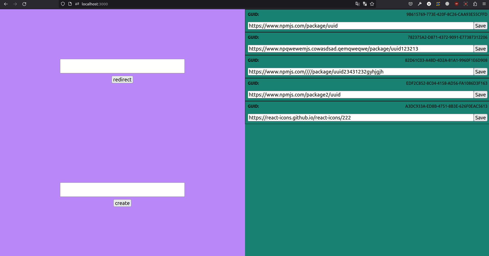

## Links Shortener

This is a simple links shortener, made with NestJS and React.

## Usage
1) Go to the root directory
2) Run `docker-compose up -d`
3) Frontend will be available on `localhost:3000`
4) Backend will be available on `localhost:4000`

## Development
1) client: `cd client && npm i && npm start`
2) server: `cd server && npm i && npm run start:dev`

## Demo

